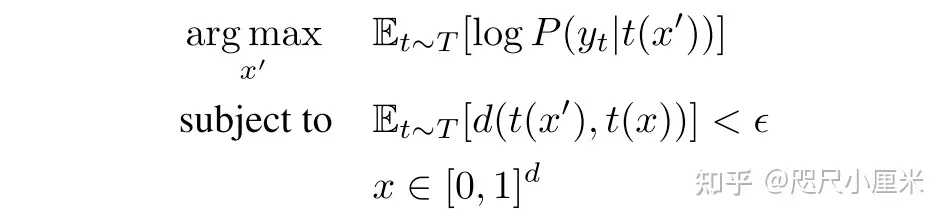
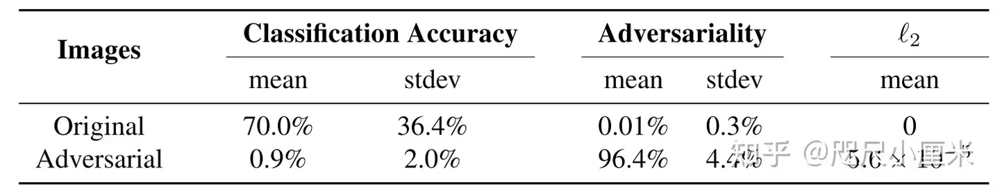
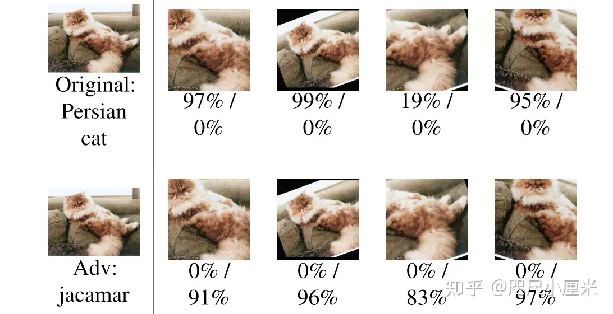
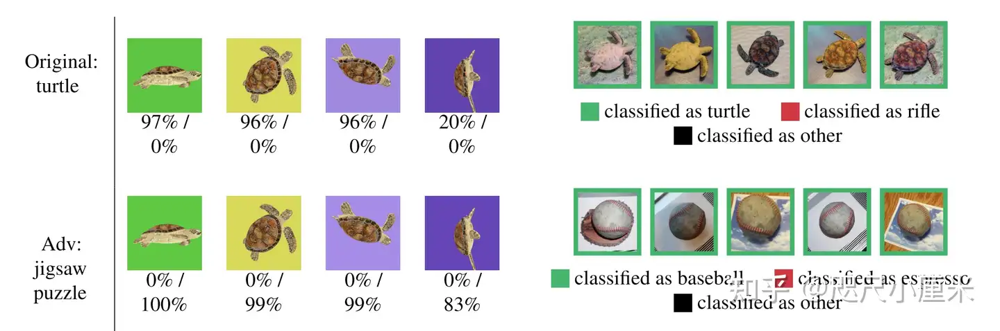

| Year      | Title                                                        | 动机               | Method | Authors                                                      | Publisher | :link:                                                       |
| :-------- | :----------------------------------------------------------- | :----------------- | :----- | :----------------------------------------------------------- | :-------- | :----------------------------------------------------------- |
| 2017.7.24 | [综合稳健的对抗性示例](https://zhuanlan.zhihu.com/p/464344544) | **没看懂**，没看完 |        | [安尼施·阿塔利](https://arxiv.org/search/cs?searchtype=author&query=Athalye,+A) | ICML2018  | [pdf](https://arxiv.org/abs/1707.07397)＆[code](https://github.com/prabhant/synthesizing-robust-adversarial-examples) |

# 摘要

​	由于视角偏移、相机噪声和其他自然变换的组合，为神经网络生成对抗性示例的标准方法在物理世界中并不总是欺骗神经网络分类器，从而限制了它们与现实世界系统的相关性。我们证明了鲁棒的3D对抗性对象的存在，并提出了第一种算法来合成在选定的变换分布上具有对抗性的示例。我们合成了对噪声、失真和仿射变换具有鲁棒性的二维对抗性图像。我们将我们的算法应用于复杂的三维物体，使用3D打印来制造第一个物理对抗性物体。我们的结果证明了物理世界中存在3D对抗性对象。

# 一、简介

​	神经网络对抗性例子的存在最初主要是一个理论问题。最近的工作证明了对抗性示例在物理世界中的适用性，表明当在近似轴对齐的环境中使用手机相机拍摄时，打印页面上的对抗性示例仍然是对抗性的。但是，尽管微小的、精心制作的扰动可能会导致神经网络中有针对性的错误分类，但当在不同的视角下捕捉到示例并受到自然现象（如照明和相机噪声）的影响时，使用标准技术生成的对抗性示例无法欺骗物理世界中的分类器（Luo et al.，2016；Lu等人，2017）。这些结果表明，现实世界的系统在实践中可能没有风险，因为使用标准技术生成的对抗性示例在物理世界中并不健壮。我们表明，基于神经网络的分类器容易受到物理世界对抗性例子的影响，这些例子在不同的视角下仍然是对抗性的。我们引入了一种新的**算法EOT**来合成对抗性示例，该算法在**选定的变换分布上是稳健**的，我们将其应用于可靠地生成稳健的对抗性图像和物理世界对抗性对象。

图1显示了使用我们的方法构建的对抗性对象的示例，其中3D打印的乌龟被ImageNet分类器一致地分类为步枪（随机选择的目标类别）。在本文中，我们证明了我们的方法的有效性和通用性，最终证明了对抗性示例是现实世界系统中的一个实际问题。

## 1.1 挑战

​	普通2D图像转换为对抗性示例的方法：L-BFGS攻击、FGSM、CW攻击等技术。虽然通过这些技术生成的对抗性示例可以转移到物理世界3D（Kurakin等人，2016），但这些技术在影响真实世界系统方面的成功有限，在真实世界系统中，输入可以在被馈送到分类器之前进行转换。先前的工作表明，使用这些标准技术生成的对抗性示例一旦经过微小的转换，往往会失去其对抗性。

​	先前试图合成对抗性例子的技术在物理世界中任何选定的变换分布上都是稳健的，但成功率有限。虽然已经取得了一些进展，但同时进行的工作已经证明了非标准分类器上的少量数据点，并且仅在二维的情况下，没有明确的三维泛化（在第4节中进一步讨论）。

​	先前的工作集中于生成二维对抗性示例，即使是对于物理世界，其中“视点”可以通过原始图像的仿射变换来近似。然而，面对不适用于2D物理世界对象的复杂变换，如3D旋转和透视投影，3D对象必须保持对抗性。

## 1.2. 贡献

​	我们证明了在物理世界中存在强大的对抗性例子和对抗性对象。我们提出了一种通用算法，用于可靠地构建在选定的变换分布上鲁棒的对抗性示例，并证明了该算法在2D和3D情况下的有效性。我们成功地计算和制造了物理世界中的3D对抗性对象，这些对象在3D视点的大而逼真的分布上是鲁棒的，这表明该算法成功地生成了物理世界上具有对抗性的对抗性三维对象。具体而言，我们的贡献如下：

•我们开发了基于变换的期望（EOT），这是第一个生成鲁棒对抗性示例的算法：单个对抗性示例在整个变换分布上同时具有对抗性。

•我们考虑了在EOT框架下构建3D对抗性示例的问题，将3D渲染过程视为转换的一部分，并证明了该方法成功地合成了对抗性对象。

•我们制作了第一个3D物理世界对抗性对象，并证明它们欺骗了物理世界中的分类器，展示了我们的方法的端到端的有效性，并证明了稳健的物理世界对抗对象的存在。

## 1. 解决的问题？

​	由于视角偏移、相机噪声和其他自然变换的组合，为神经网络生成对抗样本的标准方法并不能始终欺骗物理世界中的神经网络分类器，从而限制了它们与现实世界系统的相关性。 在本文中，作者证明了**鲁棒的3D对抗对象**的存在，并且提出了第一个算法（EOT），用于合成在选定的变换分布上具有对抗样本。 作者生成了对**噪声、失真和仿射变换**具有鲁棒性的二维**对抗图像**。同时，当算法应用于复杂的 3D 对象，使用 3D 打印制造第一个物理对抗对象，这证明了**物理世**界中存在 3D 对抗对象。

> 实现对抗性的算法，并在三维中证明存在，3D打印出来的物体具有对抗样本的性质。
>
> 应该是3D打印的乌龟，纹理和真实世界不同，虽然都是乌龟，但是它不是真的，不应该被分类为乌龟

现有的工作证明，虽然通过生成的对抗样本可以转移到物理世界，但这些技术在影响现实世界系统方面的成功有限，在这些系统中，输入可能会在输入到分类器之前进行变换。**先前的工作表明，使用这些标准技术生成的对抗样本通常会在经过微小的变换后失去攻击性**。

同时，先前的工作集中在生成二维对抗样本，即使对于物理世界也是如此，其中视角可以通过**原始图像的仿射变换**来近似。 然而，面对3D对象，并不适用 2D 物理世界对象的复杂变换，例如 **3D 旋转和透视投影**。

## 2. 提出的方法

本文创新点：
1、 引入EOT期望转换算法，并证明有效
2、 3D渲染得到的实物具有对抗性

### EOT期望转换

首先，作者提出了Expectation Over Transformation（EOT）算法，这是一个通用框架，允许构建对抗样本，这些对抗样本在选定的转换分布T上保持对抗性。然后，描述了使用生成对抗对象的端到端方法 EOT 的一种特殊应用，结合 3D 渲染过程的可微化。

通常**对抗样本的求解**可以表述为：

> x‘表示每一个像素都被归一化到[0,1]

EOT的主要想法在于，约束优化过程中对抗输入和原始输入的距离。因此，可以把扰动定义为：

定义 t(x) 为一种特定变换，则优化问题可以表述为：

EOT算法限制原始输入和目标输入的距离（小于 ε值），使得原始X不会更改过大。将x和x'距离最小化，使用随机梯度下降将x'最大化，在每一个梯度上独立采样变换。

### 关于变换

对于2D对抗样本来说，考虑变换的分布，包括通过加性因子重新缩放、旋转、变亮或变暗、添加高斯噪声和图像的平移。

> 每个像素x线性随机变换t（x）= Ax + b；

对3D对抗样本来说，考虑与某些选定的 3D 对象（形状）相对应的纹理（颜色模式）x ，并且选择变换函数t(x) 的分布，该函数采用纹理并渲染 3D 对象的姿势。变换函数将纹理映射到对象的渲染，模拟对象的渲染、光照、旋转、平移和透视投影等功能。在真实的姿势分布上找到对抗纹理允许将对抗样本转移到物理世界。

> t（x）= Mx + b, M为坐标图，b为背景。使用矩阵乘法和加法，渲染每个像素的线性组合；
> 变换函数t(x) 将纹理映射到渲染对象，包括渲染，照明，旋转，平移和透视。

作者并没有直接解决上面给出的约束优化问题，而是使带约束的拉格朗日松弛形式，就像CW攻击中那样，其距离是在LAB颜色空间计算的：

## 3. 实验和效果

采用tensorflow中的Inception V3 模型，随机选择ImageNet上的数据集1000张，并随机指定target类别，在2D和3D中实现对抗样本。

2D: 变换方式（加因子重新缩放，旋转，变亮或变暗，添加高斯噪声）我们在拉格朗日中使用固定的λ约束视觉相似性，对抗性96.4%。

3D：在3D模型中选择最小的（入）值，对抗性90%。

下图是生成的2D对抗样本。

3维打印的3D对抗样本示例：

> 实验结果：3D打印的乌龟一直被分类为步枪，而正常乌龟则分类正常。

## 4. 总结和不足

在本文中，展示了EOT算法的有效性和通用性，最终证明对抗样本是现实世界系统中的一个实际问题。作者在文章中也总结了一些常见的规律，例如变换分布越大，则所需的扰动也越大；打印机会存在颜色误差，模拟颜色误差也可以成为一种变换；扰动范围不能过小，变换的分布也不能太大。