| Year      | Title                                                        | 动机                 | Method      | Authors | Publisher | :link:                                                       |
| :-------- | :----------------------------------------------------------- | :------------------- | :---------- | :------ | :-------- | :----------------------------------------------------------- |
| 2022.3.28 | [强大的不可学习示例：保护数据隐私免受对抗性学习的侵害](https://zhuanlan.zhihu.com/p/455466528) | 最小化对抗训练中Loss | min-min-max | 傅少鹏  | ICLR2022  | [pdf](https://arxiv.org/abs/2203.14533)＆[code](https://github.com/fshp971/ robust-unlearnable-examples) |

# 摘要

## ⭐问题

​	网络空间中大量可访问的数据面临着被未经授权用于训练深度学习模型的风险

​	**现有方法**：**误差最小化噪声EM**

​		旨在利用DNN的捷径学习，一种**基于中毒**的技术

​		基于直觉设计的，即一个训练损失Loss较高的例子，梯度大，可能包含更多的知识需要学习。因此，噪声通过尽可能min Loss失来抑制数据的信息知识，从而保护数据不被学习。

## ⭐不足之处

​	然而，这种被赋予的不易学性在对抗训练中是脆弱的。**香草(原始)错误最小化噪声**EM通过最小化相应的训练损失Loss来抑制数据的信息量，不能有效地最小化对抗训练损失。这解释了对抗性训练中错误最小化噪声的脆弱性。

> 看下图，红色蓝色线，纵坐标loss，随着ρa的变大，蓝色红色线重合，表示Loss差不多，这也意味着数据又能重新学习了
>
> ρa是δa的半径，δa是直接加到图像x上，让Loss变大
>
> 总计一下：**对抗训练可以打破误差最小化噪声带来的保护，仍然可以从这些数据中学习知识**。对抗性的方法比误差最小化噪声还能降低Loss

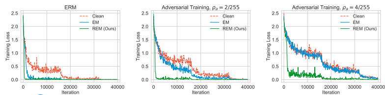

## ⭐失败原因

EM最小化的是训练损失，而不是对抗训练损失

## ⭐贡献

​	本文方法：在此基础上，设计了**最小-最小-最大优化算**法，训练**鲁棒误差最小化噪声**REM，通过最小化对抗Loss。来保护数据隐私不受对抗学习者的伤害

​	实验表明：鲁棒误差最小化噪声带来的不可学习性可以有效地保护数据在各种场景下不受对抗训练的影响。

> ps:现有的基于中毒的防护很容易被对抗训练破坏。
>

# 一、准备

## 最基本公式ERM

假设D = {(x1, y1)，···，(xn, yn)}是由n个样本组成的数据集，其中xi∈X是第i个样本的特征，yi∈Y是对应的标签。参数化的机器学习模型为fθ: X→Y，其中θ∈Θ为模型参数。设l:Y × Y→[0,1]为损失函数。然后，经验风险最小化ERM通过求解以下优化问题来逼近最优模型:

## 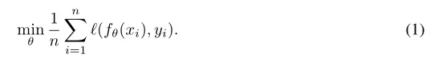

## **对抗训练**

​	对抗性训练通过对抗性实例训练提高了模型对对抗性攻击的鲁棒性。标准的对抗训练旨在解决以下最小-最大值问题：

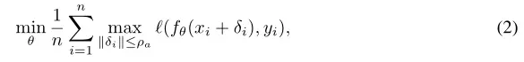

其中ρa > 0是对抗扰动半径，(xi +δi)是以xi为中心半径为ρa的球内最对抗的例子。通常，半径越大的ρa表示训练模型的对抗鲁棒性越强。

## **不可学习样本**EM

​	不可学习样本是深度学习模型无法有效学习信息性知识的一类数据。在无法学习的例子上训练的模型只能达到非常低的性能。难以学习的例子的生成包含两个步骤。首先，通过求解以下优化问题训练误差最小噪声发生器 f‘_θ

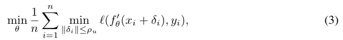

其中ρu是防御扰动半径，使所产生的最小误差噪声变得不可察觉。然后,一个不可学习样本(x0, y)通过添加EM精心训练噪声发生器产生的噪音f ’(θ)到干净数据(x, y)中,x'= 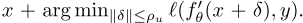

> 不可学习样本这背后的直觉是，较小的损失可能意味着从一个例子中学到的知识更少。因此，误差最小化噪声就是通过减少min相应的训练损失，使数据变得不可学。值得注意的是，一旦不可学习的数据被公开发布，数据防御者就不能再修改数据了

### 求解δ：**PGD**

​	投影梯度下降法(PGD)=先梯度下降，后投影

​	是求解方程组内(2)和(3)极值和最小值问题的一种标准方法，它通过迭代投影更新，搜索最优扰动:

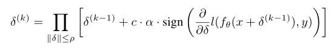

其中k为当前迭代步长(总共有k步长)，δ(k)为第k次迭代中发现的扰动，c∈{−1,1}为控制梯度方向的因子，α为步长大小， ∏ ||δ||≤ρ表示在球球{δ: ||δ||≤ρ}中计算投影。最终输出扰动为δ(K)。在本文中，在求解最大化问题时，系数c设为1，在求解最小化问题时，系数c设为−1。

## REM

### 目的

​	**最小化对抗训练中Loss**

​	对抗例子(有δa)通常比干净数据(无δa)对应更高的训练损失

### 设计

​	**min-min-max问题来训练噪声发生器**

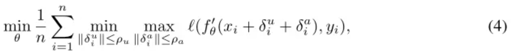

> θ让loss变小
>
> δa让loss变大，对抗扰动半径ρa控制噪声对对抗训练的保护水平
>
> δu让loss变小，防御扰动半径ρu迫使产生的噪声变得难以察觉

### 目标

​	是找到一个“更安全”的防御扰动δu∗i，使从受保护样本点(xi +δu∗i)制作的对抗样例不会过多地增加训练损失。

#### 扰动半径ρu和ρa选择ρu≥ρa

反证法：若ρu≤ρa时，对于式(4)中的每个求和项，下列不等式成立。

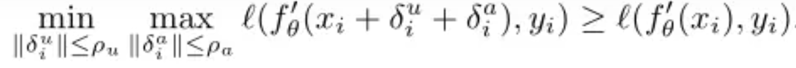

以上不等式表明，在受保护的数据集Tu上进行对抗性训练δa相当于在原始干净数据集Tc上最小化训练损失的上限，这将确保它能够恢复原始干净数据集中的测试精度

> 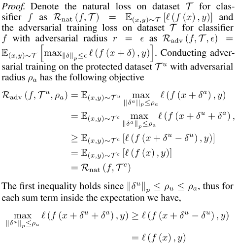

### 改进：增强噪声稳定性

然而，通过式(4)产生的噪声所赋予的不可学习性对于较小的**数据转换**来说是脆弱的。

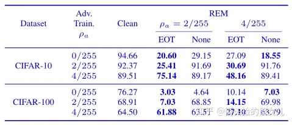

> **EOT**是一种稳定性增强技术，最初是针对对抗例子提出的。由于对抗例子和鲁棒不可学例子在一定程度上是相似的，**EOT**也可能有助于提高鲁棒误差最小噪声的稳定性
>
> 
>
> 主要想法：约束优化过程中对抗输入x'和原始输入x变换后的距离。
>
> 变换：
>
> - ​	对于2D对抗样本来说，考虑变换的分布，包括通过加性因子重新缩放、旋转、变亮或变暗、添加高斯噪声和图像的平移。
>
> > 每个像素x线性随机变换t（x）= Ax + b；
>
> - ​	对3D对抗样本来说，考虑与某些选定的 3D 对象（形状）相对应的纹理（颜色模式）x ，并且选择变换函数t(x) 的分布，该函数采用纹理并渲染 3D 对象的姿势。变换函数将纹理映射到对象的渲染，模拟对象的渲染、光照、旋转、平移和透视投影等功能。在真实的姿势分布上找到对抗纹理允许将对抗样本转移到物理世界。
>
>
> > t（x）= Mx + b, M为坐标图，b为背景。使用矩阵乘法和加法，渲染每个像素的线性组合；
> > 变换函数t(x) 将纹理映射到渲染对象，包括渲染，照明，旋转，平移和透视
>
> Q：2D，3D有啥区别？

假设T是一组变换函数{T: X→X}上的一个给定分布。然后，利用EOT训练鲁棒误差最小噪声发生器的目标函数由式(4)改编成式(5)如下:

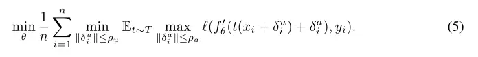

通过式(5)训练噪声发生器，得到给定数据点(x, y)的鲁棒不可学示例(x', y)为

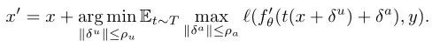

### 训练δ：PGD

​	具体来说，式(5)中的内最大化函数通常没有解析解。因此，它的梯度计算不能直接由现代Autograd系统(如PyTorch和TensorFlow)处理。为此，我们通过第一次计算来近似梯度

为此，我们首先用PGD计算最佳扰动

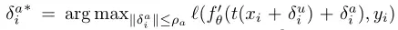

然后， 近似最大化函数的梯度

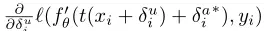

因此，当使用PGD搜索最佳防御扰动δu∗i时，可以遵循Athalye等人(2018)的方法，通过首先对几个变换函数进行采样，然后对相应的内部最大化函数的梯度求平均，来近似变换期望的梯度。利用上述的梯度近似方法对内最大化函数的梯度进行近似。最后，求解式(5)的总体过程如算法1所示。基于算法1的鲁棒最小化误差噪声的效果如图2所示，验证了对抗训练中抑制训练损失的最小化误差噪声的能力。

# 二、实验

在本节中，我们进行了全面的实验来验证鲁棒误差最小化噪声在数据隐私保护中的有效性。

## 1.实验设置

### **数据集**

我们在实验中使用了三个基准计算机视觉数据集，CIFAR-10、CIFAR-100和ImageNet子集(由前100个类组成)。每次实验都采用**数据增强**技术。数据增强的详细设置请参见附录A.2

> 我们对不同的数据集使用不同的数据扩充。
>
> - 对于CIFAR-10和CIFAR-100，我们通过**随机翻转**、每侧**填充**4个像素、**随机裁剪**到32×32大小以及每个图像的每个像素重新**缩放**到[-0.5，0.5]来执行数据扩充。
> - 对于ImageNet子集，我们通过**随机裁剪**、**调整大小**至224×224大小、**随机翻转**以及每个图像的每个像素重新**缩放**至[-0.5，0.5]来执行数据扩充。

### 源模型

ResNet-18(为主)、VGG-16、ResNet-18、ResNet-50、DenseNet-121、wide ResNet-34-10。

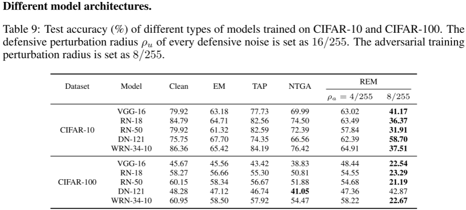

### 产生效果

### **指标**

我们利用测试**准确度**来评估噪声的隐私保护能力。测试准确度较低，说明模型从训练数据中学到的知识较少，说明噪声具有较强的隐私保护能力。

## 2.REM的有效性

### 不同扰动半径ρa

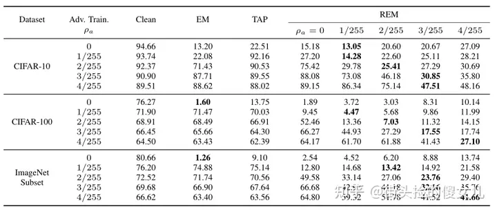

①当ρa增大时，针对不可学数据和针对性对抗性中毒数据训练的模型测试精度迅速提高。

②REM在对抗训练时也能显著降低测试准确度。此外，在极端情况下，当不可学习样本EM和有针对性的数据投毒TAP的准确度和干净数据相同时，鲁棒性不可学习数据REM仍可以将测试准确度降低到20%到40%。 这些结果证明了鲁棒误差最小噪声对对抗学习的有效性。

### **不同的保护百分比** 

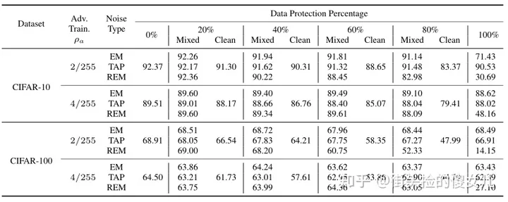

然后，我们研究了一个更具挑战性和更现实的学习场景，其中只有一部分数据被防御噪声保护，而其他数据是干净的。具体来说，我们从整个训练集中随机选取一部分训练数据，在选中的数据中加入防御噪声，并用ResNet-18对混合数据和剩余的干净数据进行对抗训练。每个噪声的防御扰动半径设为8/255，鲁棒最小误差噪声的对抗扰动半径ρa设为4/255。清洁测试数据的精度报告在表2中。混合数据和干净数据的测试精度之间的差异反映了从受保护的训练数据中获得的知识。

由表2可知，当对抗训练扰动半径较小时，鲁棒误差最小化噪声可以有效保护所选部分数据。然而，当出现较大的对抗训练扰动半径时，这种保护就变得毫无价值。这表明，为了保护数据隐私不受摄动半径ρa的对抗训练的影响，必须将鲁棒误差最小化噪声的防御摄动半径ρu设置为一个相对大于ρa的值。从表2可以看出，随着数据保护百分比的降低，训练后的模型性能提高。这表明模型可以从更清晰的数据中学习到更多的知识，这与直觉是一致的。然而，表2进一步表明，鲁棒最小化错误噪声的隐私保护能力强于最小化错误噪声和针对性对抗中毒噪声。这表明鲁棒误差最小化噪声在对抗训练时仍然比其他类型的防御噪声更有利。

### **目标模型架构**

源模型：ResNet18

目标模型：VGG-16、ResNet-18、ResNet-50、DenseNet-121、wide ResNet-34-10。

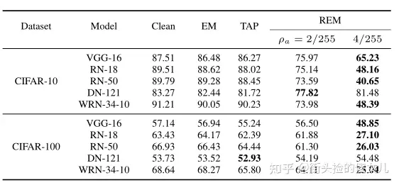

# 三、未来工作

​	①鲁棒误差最小化噪声的有效性建立理论基础。

​	②设计更有效的鲁棒的误差最小化噪声产生方法。
