| Year | Title                                                        | 动机                                                     | Method                     | Authors | Publisher | :link:                                                       |
| :--- | :----------------------------------------------------------- | :------------------------------------------------------- | :------------------------- | :------ | :-------- | :----------------------------------------------------------- |
| 2023 | **稳定的不可学习示例：通过稳定的误差最小化噪声增强不可学习示例的鲁棒性** | 我们假设防御噪声δu的不稳定性源于最坏情况扰动δa的单调性质 | 用δr代替防御噪声训练中的δa | 刘奕欣  | AAAI2024  | [pdf](https://arxiv.org/abs/2311.13091)＆[code](https://github.com/liuyixin-louis/Stable-Unlearnable-Example) |

# 摘要

## ⭐问题

网络空间中大量可访问的数据面临着被未经授权用于训练深度学习模型的风险

​	**现有方法**：

​		**误差最小化噪声EM**

​		**鲁棒误差最小化噪声REM**

## ⭐不足之处

​	EM在对抗训练中失去保护性

​	REM的计算成本高，生成速度慢。具体来说，在CIFAR-10数据集上，生成不可学习的例子几乎需要一整天的时间，这是非常低效的。因此，提高REM的效率至关重要，尤其是当扩展到像ImageNet这样的更大的真实世界数据集时。为了提高鲁棒的不可学习示例生成算法的效率

## ⭐失败原因

### 	part 0 初步分析

​	耗时的对抗性扰动δa

> Q:耗时的对抗性扰动δa?我想：第12行PGD没有解析解,计算复杂

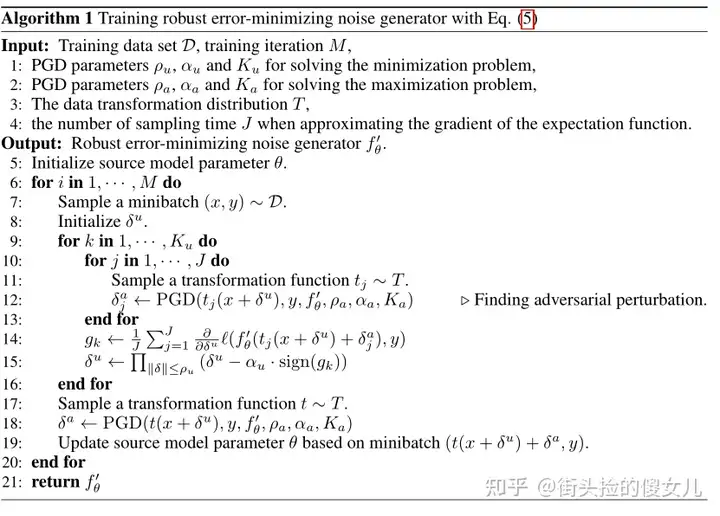

### part 1 鲁棒不可学习示例的性能分析

​	然而，最近的研究已经证明，使用对抗性训练可能会损害REM的有效性

> Q：作者估计也是看了别人的想法

看图前三行，Acc越小越好。这个✓ 表示在θ和δu训练过程中有没有考虑δa

→①**鲁棒不可学习示例的性能主要来自代理模型θ上的对抗性训练δa**，而不是防御噪声δu部分。

→②！！！**在防御噪声δu制作中存在对抗性扰动δa甚至会导致性能下降**，这表明我们在这一部分需要更好的优化方法。

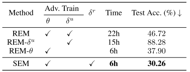

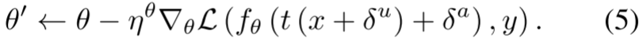

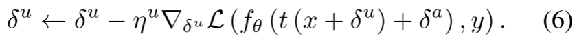

### part 2 定义代理模型θ和防御噪声δ的鲁棒性

定义1（代理模型的稳健性R_θ）。给定一个固定的代理模型θ，我们将其鲁棒性定义为模型θ对**对抗性扰动**的抵抗力，其中扰动δu是可更新的

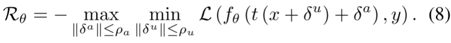

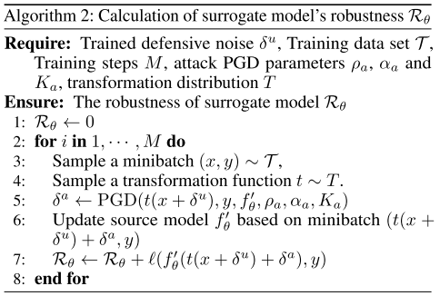

定义2（防御噪声的稳健性R_δu）。对于给定的固定防御噪声δu，我们将其鲁棒性定义为噪声对**对抗性扰动**的抵抗力，其中模型参数θ是可更新的，

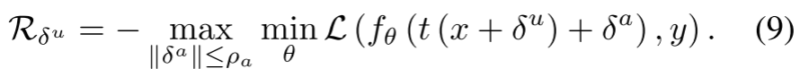

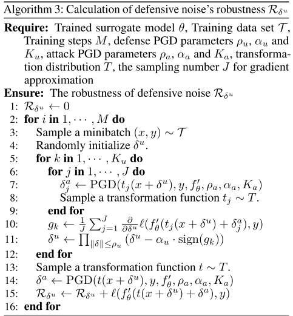

> 两个外圈是δa是因为作者将稳健性是针对δa设计的，所以要把不利因素(对抗性扰动δa)放到最大

**只有代理模型的鲁棒性R_θ才有助于提高性能**。此外，我们发现防御噪声的鲁棒性与保护性能之间存在负相关，表明防御噪声的不稳定性问题。通过**F=1−Acc定义保护性能**，其中Acc表示训练模型的测试精度。

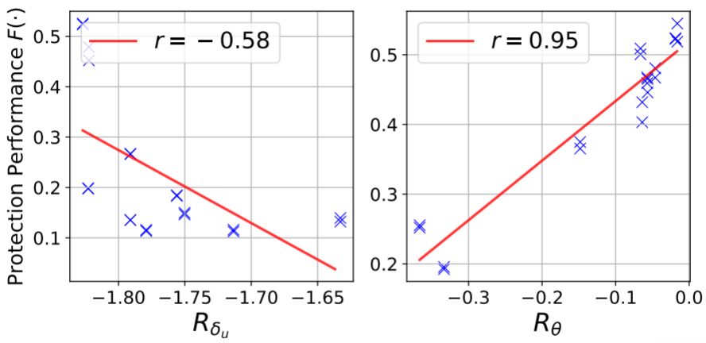

> Q：这个数据有点少，有点假，万一是个U型结构

### part 3 相关性分析

​	这些指标各有其独特之处，为相关性提供了不同的视角，无论是**线性关系**还是基于等级的关联。结果表明，**Rθ**在所有三个指标上都与保护性能呈**强正相关**。这表明，随着Rθ的增加，保护性能也会增加。另一方面，**Rδu**在所有三个指标中都与保护性能呈**中度负相关**。

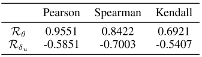

### part 4 通过UMAP 2D投影理解SEM噪声

​	**我们假设防御噪声过度适应单调的对抗性扰动，导致其不稳定性。**根据我们的**经验观察**，**REM优化中的对抗性扰动δa是单调的**，并且在评估过程中与更多样的扰动不一致。**这种现象可能是由不匹配的训练动态**引起的，因为在噪声训练阶段，防御噪声δu可以更新，而在评估过程中是固定的。

> Q:δu是固定的？因为δu确定后，数据发出来了，改不了了

进一步定义稳定性如下：

定义4（噪音的错觉）。给定防御噪声δu，我们将其错觉**RD（δu）**定义为用数据转换训练的模型fθ*的**测试损失**：

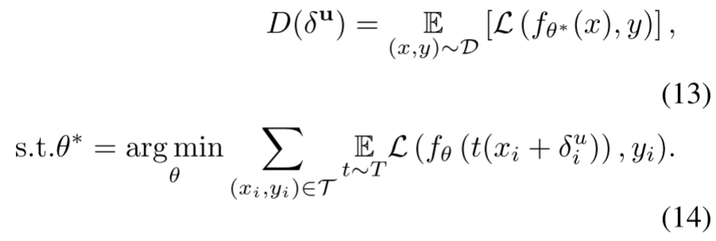

> 左边应该是RD（δu）

定义5（噪声的稳定性）。给定δu和半径为ρa的对抗性扰动δa，其稳定性S（δu，ρa）与其在扰动下的最坏情况下的迷惑性相反：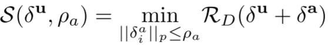

为了验证我们的陈述，我们在REM训练和实际评估阶段对随机扰动和对抗性扰动进行了UMAP可视化。如图7所示，REM中的对抗性扰动是单调的，因此，当实际扰动落在特定区域之外时，诱导的防御噪声是不“稳定”的。相反，在评估过程中，SEM中的随机扰动与真实扰动更加一致。

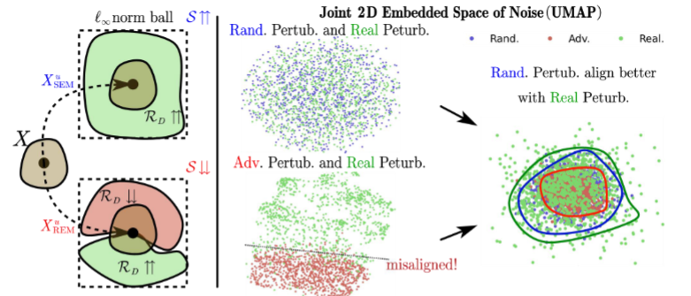

> 一致流形逼近与投影UMAP
>
> Q：real peturb是什么鬼啊？我猜，应该是最后加进去的δu吧

## ⭐贡献  

​	本文方法：在此基础上，引入**鲁棒误差最小化噪声SEM**，训练防御噪声对抗随机扰动δr，而不是耗时的对抗性扰动δa，以提高防御噪声的稳定性。

​	实验表明：①有效性：鲁棒误差最小化噪声带来的不可学习性可以有效地保护数据在各种场景下不受对抗训练的影响。②生成速度

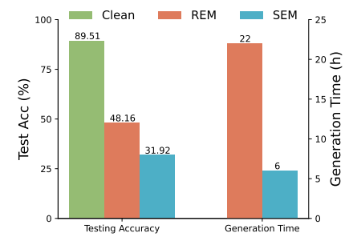

# 一、准备

### 最基本公式ERM

K类数据集服从潜在的独立同分布的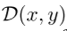分布

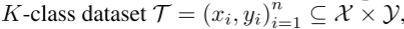。

训练方式：经验风险最小化REM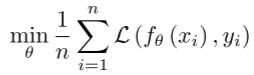

### REM

- 防御者U旨在通过向数据中添加扰动Pu来保护数据隐私，从而降低训练模型的测试精度，
- 未经授权用户a则试图使用**对抗性训练δ_i^a和数据转换T**来消除添加的扰动并“恢复”原始测试精度。

基于REM，我们假设防御者U可以完全访问他们想要保护的数据，并且在受保护的图像发布后不会干扰用户的训练过程。此外，根据REM，我们**假设防御噪声的半径ρu>对抗性训练半径ρa**，**确保了问题的可行性**。**给定变换t上的分布T:X→ X**、 我们有

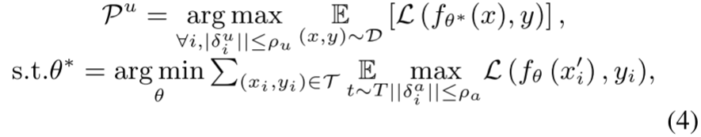

> Q：argmax δu？是不是这写错了

其中，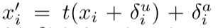表示变换数据，`δ_i^a`是利用投影梯度下降（**PGD**）制作的对抗性扰动，`δ_i^u`表示防御噪声。应用Pu后，得到受保护数据集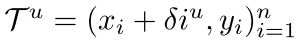

#### 	迭代训练

在代理模型θ的优化过程中，防御噪声δu是固定的。相反，当优化防御噪声δu时，代理模型θ保持固定。我们迭代地重复这些步骤，直到达到最大训练步骤。最终的防御噪声是由

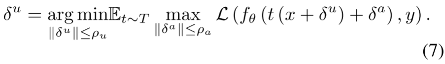

> θ让loss变小
>
> δa让loss变大
>
> δu让loss变小

### SEM

#### 	改进：增强其稳定性

假设根据等式6训练的防御噪声δu的不稳定性，源于最坏情况扰动δa的单调性质**。为了增强其稳定性，我们提出了一种针对防御噪声的替代训练目标，（**就是用δr代替防御噪声训练中的δa**）

原本

改进

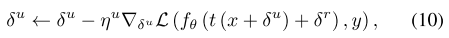

其中，δr表示从均匀分布U（-ρr，ρr）中采样的随机扰动。随机扰动的半径ρr被设置为与对抗性扰动的半径ρa相匹配。**用δr代替方程6中的δa**，可以使精心制作的防御噪声在训练过程中经历**更多样的扰动**。

> δa源于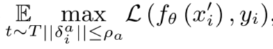
>
> δr源于U（-ρr，ρr)
>
> 我知道了，我的θ就是针对最优化了的δa决定的，但是实际上可能有各种扰动，δa需要考虑的更多一点比较好

## SEM算法

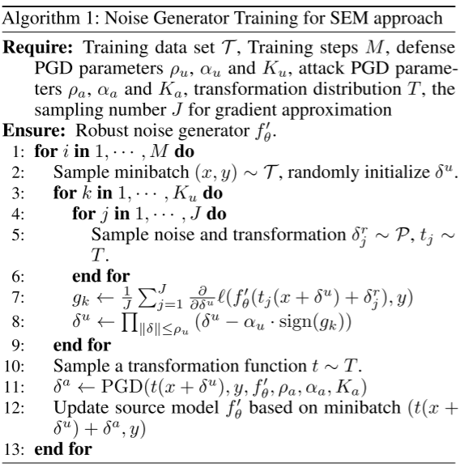

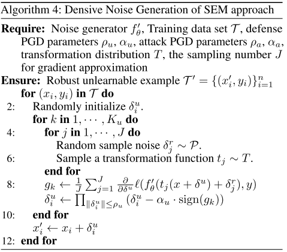

> Q: ∏ ||δ||≤ρ表示在球球{δ: ||δ||≤ρ}中计算投影。

## SEM总体框架

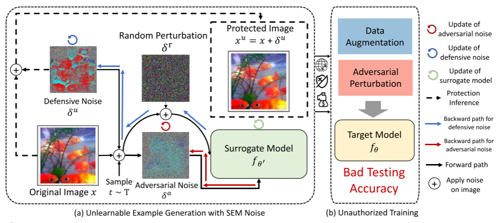

我们方法的总体框架。

我们的方法包括两个阶段：**噪声训练**和**生成器训练**。在噪声训练阶段，我们训练防御噪声，表示为δu，以对抗随机扰动δr。在随后的生成器训练阶段，表示为x的原始图像在输入到网络之前被转换为x_input=t（x+δu）+δa。这里，t表示从分布T导出的变换，δa表示使用PGD产生的对抗性扰动。噪声生成器f′θ通过最小化对抗性损失来更新网络参数θ。通过应用我们的防御噪声，在受保护数据上训练的模型学习的信息最少，在干净数据上表现出较差的性能。

# 二、实验

## 1、实验设置

### 数据集

CIFAR-10

CIFAR-100

ImageNet的子集：该数据集包括原始ImageNet的前100个类。

为了与REM一致，我们利用随机裁剪和水平翻转进行数据扩充。

### backbone

VGG16

ResNet18/50(在我们的实验中，选择ResNet-18作为默认的目标模型)

DenseNet121

Wide ResNet34-10

### 其他设置

​	默认情况下，每个数据集的防御噪声半径ρu设置为8/255，对抗性训练半径ρa设置为4/255。此外，对抗性训练半径的设置遵循REM的准则（Fu等人，2022），确保ρa≤ρu。

### baseline

​	针对性的对抗性中毒噪声（TAP）

​	误差最小化噪声（EM）

​	鲁棒误差最小化噪声REM

​	合成快捷噪声（SC）

​	神经切线泛化攻击噪声（NTGA）

## 2、性能分析

### 对抗性训练的不同半径ρa

​	防御扰动半径设置ρu=8/255，ResNet-18同时作为源和目标模型。

> ​	源模型应该是代理模型
>
> ​	目标模型应该是未经授权的用户a真正用的

​	**结论**：如表2所示，SC在标准训练设置（ρa=0）下表现最好。然而，随着对抗性训练扰动半径ρa的增加，SC的测试精度也显著提高。同样，随着对抗性训练δa的加强，其他两个基线EM和TAP的测试准确性显著提高。相反，**REM和SEM是为了更好地抵御对抗性扰动而设计的，即使半径ρa较大，也不会显著提高测试精度**。与REM相比，结果表明，我们的SEM在所有对抗性训练设置中始终优于该基线（ρa∈[1/255，4/255]），证明了我们提出的方法在生成鲁棒的不可学习示例方面的**优越有效性**。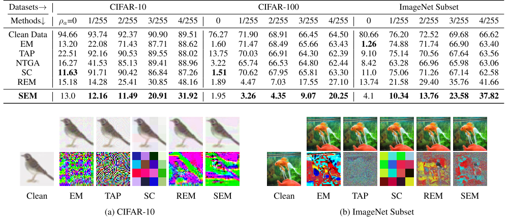

### 不同的体系结构

​	动机：为了研究不同噪声在神经网络架构中的可传递性

​	源模型：ResNet-18作为源模型

​	目标模型：包括VGG-16、ResNet-50、DenseNet-121和Wide ResNet-3410

​	数据集：CIFAR-10和CIFAR-100数据集进行

​	**结论：**SEM方法生成的不可学习的例子在整个体系结构设置中通常比REM更有效，表明其**可迁移性**更高。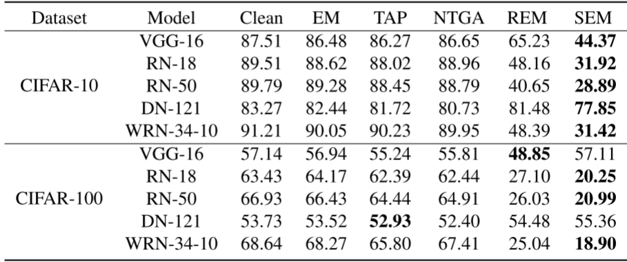

> ⭐Q:VGG-16这两行，随着数据集类别变多，SEM罕见的变大，其他都是变小(类别变多，需要识别特征需要更细，准确率会低)?
>

## 3、敏感性分析

### 低通滤波的阻力

​	动机：对图像进行**滤波**可以消除增加的防御噪声

​	三个低通滤波器：均值、中值和高斯，每个滤波器的窗口大小为**3×3**

​	对抗性训练扰动半径ρa=2/255。

​	**结论**：在应用低通滤波器后，在受保护数据上训练的模型的测试精度提高，这意味着这种**滤波部分降低了增加的防御噪声**δu。然而，在对抗性训练中应用和不应用低通滤波的情况下，SEM在这两种情况下**都表现出色**。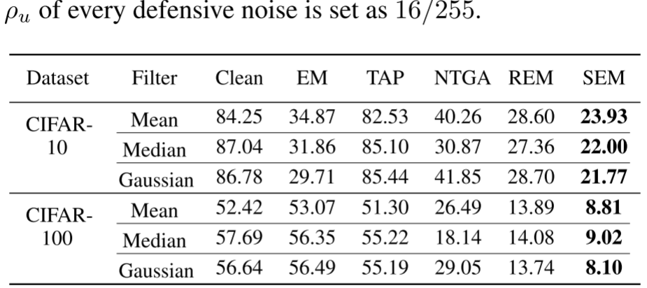

### 对早期停止和部分中毒的抵抗力

​	数据集：CIFAR-10和CIFAR-100

​	早期停止针对predict环节：改变了早期停止耐心的步骤，早期停止耐心S_es设置为3k-20k步

​	部分中毒针对验证集环节：我们将**验证集**中干净图像的比例从10%更改为70%。

​	**结论**：完全中毒（清洁率等于0%）的观察结果表明，将Ses设置为1500可将测试准确率提高4%，这意味着提前停止对不可学习示例的影响最小。然而，这种影响并不显著，需要搜索早期停止耐心超参数来缓解。增加验证集中的清洁率进一步将测试准确率恢复到57.48%，但仍低于89.51%的原始水平。**这些结果强调了我们不可学习的例子对提前停止的抵抗力**。

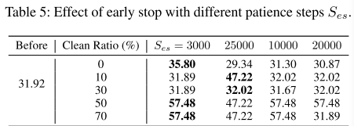

### 训练步骤M和采样大小J的影响

​	动机：评估了噪声生成过程中训练步骤M和采样大小J的影响

​	训练步骤M:	500-5000

​	采样大小J:1-6

​	**结论**：①训练步骤M的增加会提高保护效果→可以归因于噪声生成器在扩展的训练步骤上学习到更稳健的噪声模式②采样大小J，发现J的增加会使测试精度降低近8%，这突出了它在数据保护方面的重要性

> 采样大小，个人理解是batch size

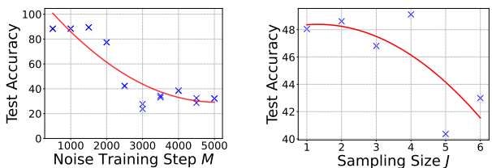

### 随机扰动半径ρr的影响

​	数据集：CIFAR-10和CIFAR-100

​	**结论**：当随机扰动半径ρr=对抗性训练半径ρa时，在不同的对抗性训练范围内，通常可以获得最佳的数据保护性能。然而，当这两个半径不匹配时，保护性能略有下降，这表明对抗性训练半径知识对保护有效性的重要性。

> Q：有意思哦，只有相等的时候效果最好？当然，ρr>ρa的保护效果比ρr<ρa要好

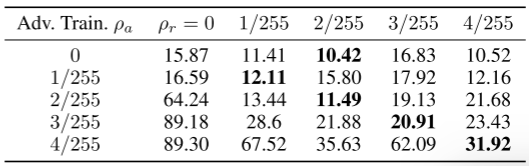

## 消融实验

​	对象：对抗性噪声δa、用于更新防御噪声的随机噪声δr。

​	结论：①1、2行更新防御噪声时消除随机扰动导致保护性能降低约8%。②1、2行使用纯对抗性噪声δa来更新防御噪声会导致保护性能恶化，突出了对抗性扰动δa的不利影响③1、4行表明用于更新噪声生成器θ的对抗性噪声δa是保护性能的关键因素。它的去除导致精度下降约60%。

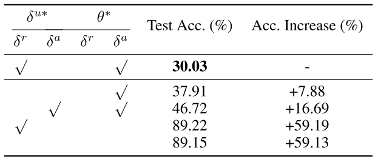

## 生成速度

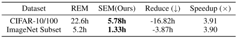

## 案例分析：面部识别

​	动机：现实世界人脸识别中的有效性

​	数据集：Facescrew的子类。随机选择了十个类别，每个类别包括120幅图像。我们分配了15%的数据作为测试集，得到1020张用于训练的图像和180张用于测试的图像

​	**结论**：在对抗性训练下，稳健方法，即REM和SEM，在数据保护方面优于其他非稳健方法。特别是，在各种对抗性训练半径内，基于SEM保护数据训练的模型的测试准确率降至9%左右，这标志着准确率显著下降了约40%至50%。此外，我们从图6中观察到，稳健的方法会产生更生动的保护图像。例如，SC创建马赛克状图像，而EM和TAP显著降低亮度，损害面部识别。相反，**REM和SEM扰动集中在边缘，保持视觉相似性**。

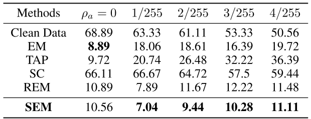

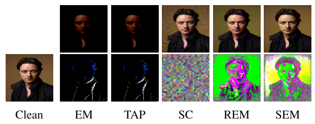

## 更多结果

### 部分中毒情况下的有效性

在一个更具挑战性的现实学习环境中，只有一部分数据可以受到防御噪声的保护，我们还研究了不同中毒率对在中毒数据集上训练的模型的测试准确性的影响。从表11可以看出，当中毒率等于或高于80%时，我们的方法优于其他基线，并且在中毒数据集上训练的模型的测试精度随着中毒率的增加而降低。然而，在较低的中毒率设置下，模型可能会从干净的示例中学习，所有现有的噪声类型都不会显著降低模型性能。**这一结果表明了现有不可学习方法的共同局限性，需要对这一具有挑战性的环境进行进一步的研究**。

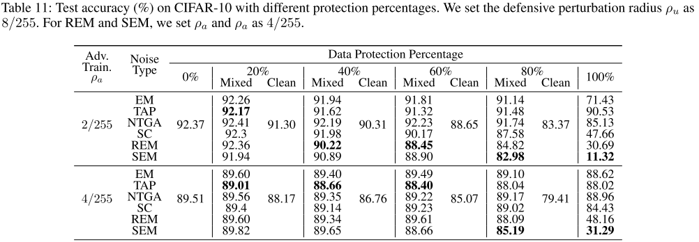

### 的影响ℓ∞ 攻击算法

我们在REM上提供了不同的额外结果ℓ∞-规范对抗性攻击算法，包括FGSM、TPGD和APGD（来自torchattacks）。如表14所示，结果表明它们仍然不如SEM，这表明REM优化的局限性根源。

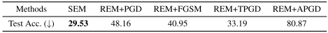

> Q：不知道什么东西
