| Year      | Title                    | Task Type | 动机 | 方法 | Authors | Publisher | :link:                                                       |
| :-------- | :----------------------- | :-------- | ---- | :--- | :------ | :-------- | :----------------------------------------------------------- |
| 2024.2.21 | 推荐系统的协作大语言模型 | 语义gap   |      |      | 朱耀辰  | WWW2024   | [pdf](https://arxiv.org/abs/2311.01343)＆[code](https://github.com/yaochenzhu/llm4rec) |

# 摘要

## ⭐问题

①LLM能力：LLM有语言模型的编码能力、LLM的逻辑推理能力、生成能力→适用于用户项目与大量文本特征相关联

②RS不足之处：基于LLM的RS显示出解决基于ID的RS长期存在的问题的潜力，如对用户/项目文本特征的理解不足、**泛化能力差**等

③自然语言和推荐任务之间的**语义差距**仍然没有得到很好的解决，导致了用户/项目描述符的**虚假关联**、用户/项目数据的语言**无效建模**、自回归推荐**效率低下**等多重问题。

**前人尝试**：

（i）首先，不是用连续的ID嵌入来**表示用户/项目**，而是将根据用户兴趣进行推理和生成推荐所需的相关信息，例如交互项目、用户/项目特征和候选项目，**转换为基于离散自然语言的提示**

（ii）然后，该提示用于查询LLM，其中从LLM的文本输出中检索与推荐相关的信息，以生成推荐（直观示例见图1）

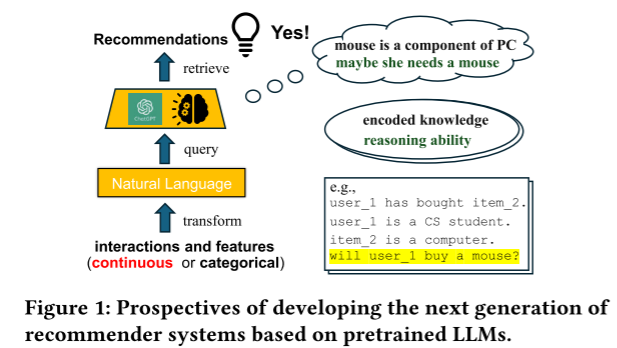

上述程序可以以**零样本方式**执行，其中推荐决策直接从预先训练的LLM中获得（例如，我们将关于用户和项目的所有相关信息输入到ChatGPT的聊天框中，并询问用户是否会与项目交互），

或者如果有基本事实，也可以用交互和特征数据对预先训练的LLM进行**微调**

> 一个示例性的工作是**P5**，它在根据交互和用户/项目特征建立的语料库上微调T5，其中项目由**伪ID**表示。
>
> 之后，**M6**被提出在预训练阶段将文本填充和自动回归任务相结合，其中伪ID被**文本描述**所取代。
>
> **TALLRec**，其中项目由伪ID和文本描述表示。然而，基于伪ID的项目表示可能会在不相关的项目之间**引入虚假的相关性**。

为了解决这个问题，此外，候选项目需要在提示中明确提供，推荐是通过**低效**的自回归生成的。总之，NLP和RS之间的二分法仍然没有得到很好的解决。

## ⭐不足之处

NLP和推荐之间的根本分歧仍有待解决——自然语言和用户/项目语义之间的差距。

## ⭐失败原因

​	①RS采用**ID范式**建模，可能会引入**虚假的相关性**。作者从①开始入手LLM+ID token

> 应该是之前公式推导的论文两个：①误点②没接触过但是感兴趣
>
> Hua等人提出**引入少量新的token**来描述项目，这些token由项目的**内容和交互相似性**决定。然而，使用**共享令牌**对项目进行索引**仍然会引入偏见**。

​	②RS采用基于描述建模。如项目标题/基于内容相似性分配给不同用户/项目的少量新引入的token，但是在**语义相似性上有强烈的归纳偏见**，这可能无法忠实地捕捉真实的语义。

## ⭐贡献：

​	本文提出了CLLM4Reg，这是第一个将LLM范式和ID范式紧密结合在一起的生成RS，旨在同时解决下述挑战。

更准确的用户-项目**交互和语义建模**→用用户/项目ID token扩展预训练的LLM的词汇表

​	①直接引入真正的用户/项目ID token？通常被认为对LLM不可行，因为直接对具有异构token的序列进行语言建模可能是无效和不稳定的，尤其是当大多数LLM的词汇表可能被大量随机初始化的用户/项嵌入稀释时。

​											有效的语义建模→提出了一种新的**软硬提示**策略，通过在RS特定语料库上的语言建模来有效地学习用户/项目协作/内容令牌嵌入，其中每个文档被划分为由异构的**软（用户/项目）令牌**和**硬（词汇）令牌**组成的提示和由同构的项目令牌或词汇令牌组成的主文本，以促进稳定有效的语言建模。

> CLLM4Rec 模型**只允许用户/项目token 嵌入是可训练**的(软)，同时保持词汇token嵌入和 LLM 结构的其余部分固定（硬）。这确保了保留LLM的预训练的知识，同时为推荐目的调整模型

​	②有效学习ID token的挑战？

​		A**序列顺序带来的噪声**：由于交互顺序通常对直接推荐无关紧要，而人类语言自然具有顺序，因此在将用户历史交互转换为文本句子时，可能会为放置在不同位置的项目引入虚假的时间相关性。

​											→**随机项目重新排序策略**,以忽略项目token的顺序，而不会对词汇token产生负面影响。

​		B**训练任务不同带来的噪声**：此外，对于内容建模，由于预训练的LLM不是面向推荐的，因此它们可以很容易地捕获与推荐目的无关的用户/项目文本特征中的噪声。

​											→**软硬提示策略**→两个LLM的预测头分别关注交互和内容信息，从而大大提高语言建模的稳定性和有效性。

​											→引入了一种新的**异构token双向正则化**策略，以鼓励CLLM4Rec从有**噪声**的用户/项目内容中捕获推荐相关信息

​		C**生成式的低效推荐**：此外，由于LLM以**自回归顺序生成**方式生成下一个token，因此与基于ID的方法相比，通过基于LLM的RS进行多个推荐可能是低效的。

​		+											

​		D**候选池大带来的高延迟**：最后，对于基于伪ID和基于描述的索引方法，通常需要在提示中明确提供候选项，以避免产生幻觉。这些问题阻碍了基于LLM的RS的实际应用，其中候选池很大并且低延迟很重要。

​											高效推荐→**面向推荐的微调策略**，其中将具有多项式似然性的**项目预测头**添加到预训练的CLLM4Reg主干中，以基于从掩蔽的用户-项目交互历史建立的软硬提示来预测搁置项目，其中可以有效地生成多个项目的推荐，而不会产生幻觉。

# 一、准备

## 1 问题规范化

重点是设计一个推荐系统，该系统使用

1、**交互**：来自用户的**隐式反馈**，例如他们是否与项目进行了交互，由二元评分向量表示。

2、**文本**：用户和项目的**文本特征**（如用户简介或项目描述）以及用户与项目的**特定交互**（如**评论**）被编码为文本序列中令牌的独热编码向量。

3、预训练的 LLM 用于处理这些序列，通过自注意力模块将它们转换为潜在序列。
$$
用户i文本特征x_i^u，如用户简介。
项目j文本特征x_j^v，如项目内容。
用户i和项目j相关文本特征x_{ij}^{uv}，如用户i对文本j的评价。
x_{\{i,j,ij\},k}^{u,v,uv}表示文本序列中第K个token。
二进制评分r_i∈\{0，1\}^J表示是否交互过。
p_{llm}(x_{k+1}|x_{1:k})。
𝐿层堆叠式自注意模块
$$

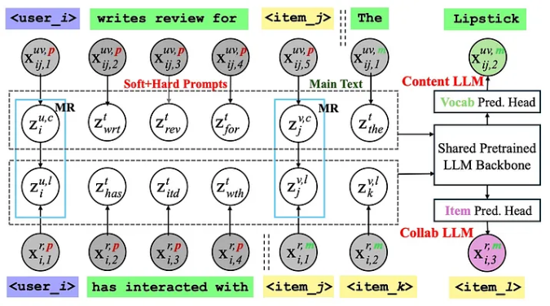

## 2 用户/项目token的扩展

### 	词汇扩展

​				新引入的token属于原子令牌，`<user_𝑖>` `<item_𝑗>`分别表示第i个用户和第j个项目，token ID为 𝑁+𝑖 和𝑁+𝐼+𝑗

### 	token嵌入初始化

​				对于新引入的用户/项目token有两种类型的嵌入方式(协作语义+内容语义)，与词汇空间对齐

#### 			协作token嵌入

$$
z_k^t表示第k个词汇token的嵌入。
z_i^{l,u},z_j^{l,v}{\sim}N(0,λ_l^{-1}*I_k),λ_l是先验精度。
$$

​				是从与 LLM 的词汇表嵌入大小相同的潜在空间中采样的，具有定义的先验精度

#### 			内容token嵌入

$$
z_i^{c,u}{\sim}N(z_i^{l,u},λ_c^{-1}*I_k)，z_j^{c,v}{\sim}N(z_j^{l,v},λ_c^{-1}*I_k),λ_c是条件先验精度。
词汇token的水平堆叠矩阵Z^t。
交互token的水平堆叠矩阵Z^{l,\{u,v\}}。
内容token的水平堆叠矩阵Z^{c,\{u,v\}}。
$$
> Q：为什么内容token的embedding依赖协作token的embedding？我估计反一反也行

​				根据协作嵌入有条件地对内容令牌嵌入进行采样，**以使内容语义与协作语义保持一致**，这对于面向内容的推荐建模至关重要。

#### 		CLLM4Rec基本模型

$$
h_{\{𝑙,𝑐\},1:𝑘}^{\{𝐿\}} =\widehat{llm}_{𝑙,𝑐} (x_{1:𝑘}),其中𝑙代表矩阵Z^{l,\{u,v\}}，𝑐代表矩阵Z^{c,\{u,v\}}
$$

​			CLLM4Rec 将这些新的用户/项目标记及其嵌入到 LLM 中。此模型使用自注意力模块将标记序列映射到隐藏空间中，表示词汇表、用户或项目标记的输入。

## 3 相互正则化MR预训练

### **特定于推荐的语料库**

​	加入id token面临着一个**挑战**：因为添加的用户和项目标识符开始时没有特定的含义(随机初始化)，可能会使语言模型的现有词汇不堪重负（被稀释，词汇token的数量（例如，GPT为～50k，T5为～30k）），使模型更难有效地学习。

### **软硬提示**

​	为了应对上述挑战，我们提出了一种新的软硬提示策略。

​				prompt=异构的软（用户/项目）和硬（词汇）token，提供关于文档要点的上下文信息

​				主文本=同质的词汇token详细实现前置条件的主文本部分。

#### 	协作LLM

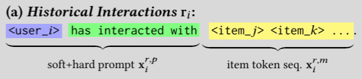

​	因此，我们可以将第一部分视为软硬提示，只对第二部分进行语言建模。这鼓励模型只关注协作和内容信息，从而可以大大提高语言建模的有效性和稳定性。

​				通过向CLLM4Rec基本模型
$$
\widehat{llm}_{𝑙}
$$
​				添加**项目预测头**（如下），使用最后一个隐藏表示来预测下一个项目标记的概率
$$
f_l:R^{K_h}→P(J)
$$
​				权重f_l和项目协作token绑定

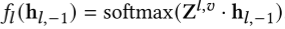

​				协作LLM的生成过程可以表示为：

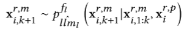

​				从而使用户和项目嵌入保持一致以捕获协作语义。

==>但由于用户/项目交互是**稀疏**的，因此在优化等式时，协作LLM很容易对观察到的交互进行**过度拟合**

#### 内容LLM

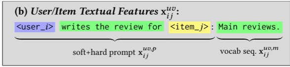

​				通过向CLLM4Rec基本模型(如下)：

$$
\widehat{llm}_c
$$
> 注：llm_c和llm_l共享预训练的LLM，但用Z^{c,{u,v}}解码用户/项目token

​				添加**词汇预测头**（如下），使用最后一个隐藏表示来预测下一个词汇标记的概率
$$
f_c:R^{K_h}→P(N)
$$
​				权重f_c和词汇token绑定

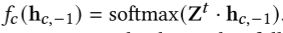

​				内容LLM的生成过程可以表示为：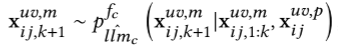从而使内容信息被编码在用户/项目的内容token embedding中。

> 例如，预训练的LLM将知道<item_46>是一种深紫色、红色和粉红色的口红，可能会有干燥嘴唇的副作用，以及<user_57>喜欢颜色但讨厌副作用的原因，可以通过涂抹润唇膏来缓解。
>
> ==>由于预训练的LLM不是面向推荐的，因此天真地优化等式不可避免地从与推荐无关的内容特征中捕获噪声信息

#### 讨论

​	提示的“硬”部分包含词汇标记，有助于使用预训练语言模型的现有知识来触发其推理功能。

例如，

​	①像“已交互”这样的短语向协作语言模型发出信号，它应该理解`<user_i>`为用户，而之后的`<item_j>`为用户与之交互的项目。

​	②“为之撰写评论”有助于内容语言模型理解正文将包含`<user_i>`基于个人经验对项目`<item_j>`的评论。

​	③提示的具体表述可以是灵活的，正如耿等人[18]已经证明的那样，**只要含义相同，并且提示在训练和测试阶段是一致的，提示表达的变化就不会产生太大的差异。**

### 相互正则化的预训练学习

#### 问题

​		①但由于用户/项目交互是稀疏的，因此在优化等式时，协作LLM很容易对观察到的交互进行**过拟合**

​		②由于预训练的LLM不是面向推荐的，内容LLM与推荐无关的内容特征中捕获**噪声**信息

#### 动机

​		协作LLM可以引导内容LLM从用户/项目内容中捕获推荐相关信息，而内容LLM反过来可以引入辅助信息来支持协同过滤

#### 环节

​		token嵌入的对齐生成环节

#### 生成过程

给定了两种prompt情况下，去预测用户z-项目Z两种嵌入方式l,c,以及具体的生成结果

联合分布可以分解为三个部分：

1. 学习用户/项目令牌嵌入的协作和内容LLM的**语言建模**；

2. 连接两个LLM的用户/项目token嵌入的**相互正则化**。根据token嵌入初始化的公式，由于下面两个式子是条件高斯，最大化似然函数时候相当于引入MSE正则化

   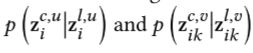

3. 由于相互正则化而通常被忽略的**先验**。z的先验`𝜆_𝑙`和`𝜆_c`, 由于存在相互正则化（即设置精度𝜆_𝑙 在等式（1）中的先验中为零）。

​	我们使用最大后验（MAP）来估计用户/项目token嵌入, 其中目标与等式（6）中定义的联合分布的对数成比例。在这里，我们采取**交替步骤**来优化MAP目标。如果我们表示与项目token预测头`f_l`和词汇token预测头`f_c` 相关联的可训练参数𝜽 。具有相互正则化的协作LLM（L步）和内容LLM（C步）的目标可以如下推导：

##### 			协作LLM-L步-缺内容

​					修复内容token嵌入，并使用它们来约束**用户/项目协作token嵌入**以及协作LLM的语言建模，从而实现以下复合目标：

​					LM loss捕获了用户𝑖 以及交互项目token嵌入之间的协作相似性，其中可以通过MR loss引入辅助信息以支持协同过滤。

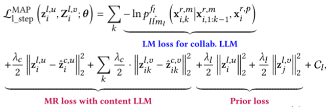

> Q:prior loss里面z_j^{l,v}的z应该是Z
>
> z_head是因为交替进行被冻住了

##### 			内容LLM-C步-缺协作

​					在L步骤的一步优化之后，我们修复了用户/项目协作token嵌入，导致内容LLM的以下复合目标：

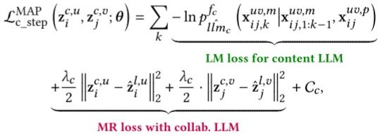

> z_head是因为交替进行被冻住了

### **随机项目重新排序**

#### 	动机

​			① 项目顺序通常对直接推荐不重要，因为用户的长期兴趣可以被视为固定的

​			② 即使重要，表示自然语言顺序的位置嵌入也可能无法捕捉交互顺序的语义	

#### 	具体操作

​				随机置换`x_i^{r,m}`里的项目token

#### 	好处

​				允许模型忽略项目token顺序，防止对用户交互中词汇token的处理产生任何负面影响。

## 4 以推荐为导向的微调

### 预训练

预训练：旨在通过语言模型，基于用户-项目交互和用户/项目文本特征建立起来的大型语料库，**学习用户/项目token嵌入**。

挑战：

①仅靠预训练不足以弥合自然语言处理和推荐系统之间的差距。**然而，预训练的CLLM4Rec只能根据prompt完成项目/词汇token序列，而不能进行推荐，因此NLP和RS之间的差距仍未完全消除。**

②直接使用 CLLM4Rec 进行推荐的**计算成本很高**。因为推荐项目是通过**自回归顺序生成**的。

### 具有多项式预测头的mask提示进行面向推荐的微调

​	针对这一问题，该文提出一种面向推荐的微调策略，该策略对预训练模型进行了细化，以实现高效推荐。这涉及mask提示策略，其中一部分用户交互项被屏蔽以创建旨在提出建议的提示。这些提示通过将过去的交互与未来的预测相关联来刺激模型的推理。

`J`个候选项目目标保持项目`r_i^hold`被约束在项目概率空间中，可以避免产生幻觉的项目。

> `r_i^masked`被mask
>
> `r_i^hold`被视为目标（target）。属于multi-hot编码，对于某个属性对应的分类特征,可能该特征下有多个取值。

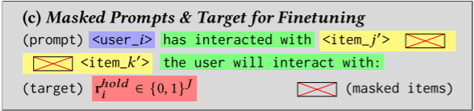

​	微调后的模型称为 RecLLM，它采用基本的 CLLM4Rec 模型，并添加了一个具有多项式似然的新**项目预测头**`f_rec`，该头也链接到项目token嵌入。

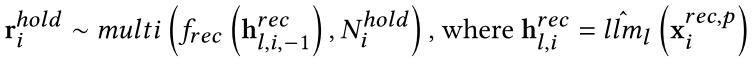

​		`𝑚𝑢𝑙𝑡𝑖 `表示多项式分布，以及`𝑁_i^ℎ𝑜𝑙𝑑 `是用户的搁置项目数。，

​		其中NLL表示负对数似然，从多项式NLL损失的形式，我们可以发现，当根据等式（10）微调RecLLM时。`f_rec（）`里面的变量看作是总结用户历史交互的潜在变量，要求和所有交互项目的协作嵌入相似。等式（10）与等式（7）类似方式，将其与内容LLM正则化。

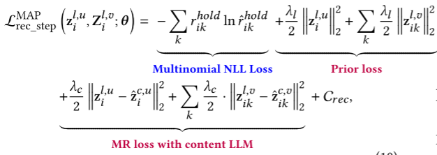

​		这允许在单个前向传播步骤中生成推荐。微调包括一个正则化步骤，该步骤将用户的潜在变量与交互项的协作嵌入对齐，并使用随机项重新排序来避免过度拟合到特定项顺序

## 5 使用 CLLM4Rec 进行预测

​		在 CLLM4Rec 的预训练和微调过程完成后，要为用户提出建议，该用户交互的整个历史记录将用于创建推荐提示。然后，此提示(无mask版)被输入到 RecLLM 模型中。通过模型中的单个前向传播`𝑚𝑢𝑙𝑡𝑖 `，计算所有项目的多项式概率分布，该分布表示用户感兴趣的每个项目的可能性。然后，该模型选择用户**尚未与之交互**的得分最高M个的项目作为其建议。

# 实验

## 数据集

​	四个公共数据集：亚马逊美容数据集、亚马逊玩具数据集、亚马逊运动数据集和Yelp数据集

在预处理中，我们通过仅保持评级>3来对交互进行二值化，并将其视为隐含反馈。此外，我们对数据集进行过滤，使其在**二值化后保持5核特性**。对于每个用户，我们随机选择80%的交互进行训练，10%进行验证，10%进行测试，其中在验证和测试集中至少选择一个项目。

> 5核特性：这意味着在进行二值化处理后，数据集中的每个用户和物品都至少具有5个评分。这种过滤操作可以确保数据集在二值化后仍然具有足够的稠密度，以便于建模和分析，同时减少了数据中的噪音和稀疏性。

​	领英工作推荐数据集

真实世界的实验基于LinkedIn收集的工作推荐数据集，其中用户对招聘广告的点击被记录为隐含反馈，用户提供的个人简历以及工作描述作为文本特征

## 研究问题

### •RQ1：性能。

​		CLLM4Reg是第一个将基于ID的范式与基于LLM的范式紧密结合的RS，与最先进的基于ID和基于LLM RS相比，它的表现如何？

### •RQ2：预训练阶段的消融实验

​		CLLM4Rec的预训练阶段（包括相互正则化技巧和随机项目重新排序策略）如何影响CLLM4Reg的性能？

### •RQ3：微调阶段的消融实验

​		具有掩蔽提示和多项项目预测头的CLLM4Rec的微调阶段如何影响推荐的效率和有效性？

## backbone

​	gpt2，T5模型，LLaMA-7B。

## 实现细节

​			在本节中，我们介绍了主论文中使用的基于GPT-2的CLLM4Rec的实现细节。

​			在训练阶段，我们首先最优化内容LLM，如等式5所示，通过10个epoch的语言建模来预热用户/项目内容token嵌入。

​			然后，在相互规则化的**预训练**阶段，我们交替地训练如等式（7）和（8）用100个epoch所述的协作LLM和内容LLM。。

​			最后，我们对150个epoch进行了面向推荐的**微调**，其中Recall@20, Recall@40和NDCG@100在验证集上计算进行度量

​			具有**最佳性能的RecLLM**将作为最终结果在测试集上进行记录和评估。

​			先前的精度𝜆𝑐 在等式（7）和（8）中是控制相互正则化强度的重要超参数。在主要论文中，我们首先在第4.2节中将其值固定为网格搜索找到的最优值，并将其与其他基线进行比较，然后在第4.3节中讨论其影响。

## 指标

​	推荐指标：召回率recall，NDCG

​	推理时间

## baseline

### 	基于ID的baseline

> ​		•Multi-Vae是是一个基于ID的协作过滤基线，通过重建评分r来推荐新项目𝑖 通过具有**多项式似然**的变分自动编码器（VAE）。
>
> ​		•Md-Cvae是一个混合RS，它通过在**文本特征**上引入**双特征VAE**来正则化r的重构，从而扩展了Multi-VAE𝑖 在多VAE中。

### 	基于LM的baseline

> ​		•Bert4Rec使用BERT[31]中提出的**掩蔽语言建模**（MLM）来学习用户/项目嵌入，以通过双向自我关注进行推荐。
>
> ​		•S3Rec通过用**辅助任务**（如**项目属性预测**）增强MLM来扩展BERT4Rec，其中内容特征可以融合用于自监督学习。

​			请注意，BERT4Rec和S3Rec都是为顺序推荐而设计的。在本文中，我们使用与CLLM4Rec类似的面向推荐的微调来将其适应于直接推荐，其中使用由掩蔽交互生成的项目序列来预测具有多项可能性的所有保持项目。

### 	基于LLM的baseline

> ​		•Llm Scratch与CLLM4Rec具有相同的结构，但它**从头开始训练整个模型**，而不是加载和固定预训练的**Llm骨架的权重**。
>
> ​		•Llm CF从CLLM4Rec和相互规则化的预训练步骤中消除了**内容Llm**，仅使用协作Llm和RecLLM进行推荐。
>
> ​		•Llm FtALL与CLLM4Rec具有相同的结构，但它**对整个网络进行了微调**，包括**vocab嵌入**以及预训练Llm的其他部分，而不是只训练新引入的用户/项目令牌嵌入。
>
> ​		•Llm FixOrd与CLLM4Reg具有相同的结构，但它删除了预训练中的协作Llm和微调中的RecLLM的**随机项目重新排序策略**。
>
> ​		•Llm-PreRec放弃微调，并在预训练阶段对协作Llm的下一个项目标记预测头的**分类概率进行排名****，以提出建议。

#### 			定性分析

​		对于**其他现有的**基于LLM的RS（即第2.2节中引入的基于伪ID和基于描述的方法），它们用多个token表示用户/项目，并将直接推荐公式化为**下一个token生成问题**。由于生成的token可能与推荐目的无关，因此通常需要在提示中明确提供候选项目，以避免产生幻觉（例如，P5[18]提供100个候选项目，其中一个是肯定的，TALLRec[35]根据提示中的用户/项目描述输出是/否决定，等等）。相反，CLLM4Rec可以同时从整个项目候选池中生成多个推荐。

#### 			公共数据上的结果

​		我们首先分析了四个公共数据集上的实验结果，为RQ1, 2, 3.提供了初步答案。

​		 从表1和表2中，我们可以发现IDbase方法Multi-VAE仍然是协作过滤（CF）的强大基线。LLM-CF是CLLM4Reg的CF主干，在AM Sports和Toys数据集上都无法击败Multi-VAE，即使**提示的“硬”部分触发了预训练LLM的推理能力**。

​			CLLM4Rec 在大型文本数据可用时表现出色，因为 CLLM4Rec 能够利用预训练 LLM 的深刻理解，而其他一些模型(如MD-CVAE)无法通过其浅文本特征表示来做到这一点。LLM-Scratch 的性能较差，它不使用预训练的知识，这**凸显了这些知识的重要性**。

​			有趣的是，LLM-FTAll对整个模型（包括LLM主干）进行了微调，其性能比CLLM4Rec更差，CLLM4Rec仅优化了新的用户/项目令牌嵌入。这表明，**使用特定于推荐的语料库对整个 LLM 进行微调并不能很好地适应推荐系统，并且实际上可能会降低其泛化能力**。

​			LLM-PreRec 在预训练阶段使用协作 LLM 进行推荐，是一个强有力的基线，验证了**软硬提示**组合策略在具有异构标记的面向推荐的语料库上的有效性。然而，CLLM4Rec 的性能仍然优于 LLM-PreRec，这表明**面向推荐的微调**是调整协作 LLM 以提供有效建议的关键

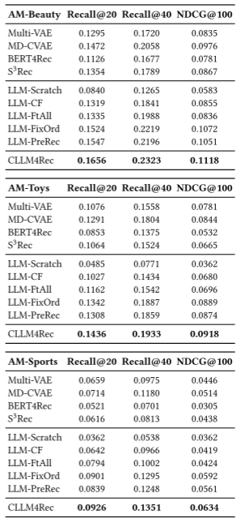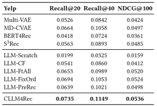

#### 			LinkedIn数据集上的结果

> **双塔（TT）模型**：
>
> ​	TT模型被实现为两分支多层感知器（MLP），其中输入的用户/项目嵌入包括从在用户工作二分图上学习的图神经网络（GNN）中提取的嵌入，以及从内部BERT模型中提取的特征。
>
> **M6 Retrieval：**
>
> ​	此外，由于文本特征几乎适用于每个用户和项目，我们将CLLM4Rec与最先进的基于LLM的RS，**M6 Retrieval**进行了比较，后者从M6 transformer中提取用户/项目描述的维度推导嵌入作为对比建议。

​		在实际测试中，CLLM4Rec 的性能明显优于浅TT模型。尽管性能更好，但 CLLM4Rec 的**推理延迟**对于实时在线部署来说仍然太高，尤其是与 TT 模型更快的推理时间相比。

​		为了解决这个问题，**通过将 CLLM4Rec 中的用户和项目token嵌入（预计为 128 的大小）合并到 TT 模型中，**创建了一个新的基线模型 **CLLM4Rec-Emb**。在离线实验中，这种混合方法比原始 TT 模型和 M6-Retrieval 提高了性能，表明 CLLM4Rec 可以适应低延迟至关重要的实际工业应用。

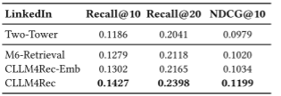

> Q：没有速度的数据
>

#### 			参数敏感性分析

​		以进一步回答RQ2和3，𝜆__𝑐 控制相互正则化的强度并研究其如何影响CLLM4Rec的性能。

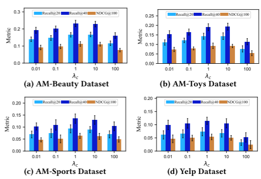

从图4中我们可以发现，当**𝜆𝑐 较小，相互正则化较弱**，并且内容LLM**不能提供**足够的用户/项目**内容信息**来支持协作LLM和RecLLM。因此，**推荐性能退化到与LLM-CF相似的水平**。

另一方面，当**𝜆𝑐 太大**，等式（7）、（8）和（10）中的MR损失占主导地位，这阻碍了CLLM4Rec通过语言建模学习有用的用户/项目token嵌入。

通常，对于所有四个数据集，CLLM4Rec的性能峰值在𝜆𝑐 = 1，这在将基于GPT的CLLM4Rec应用于新数据集时是一个良好的开端。

# 改进方向

1、数据集二值化后保持5核特性：新项目和新用户(不稠密)的加入？
