| Year      | Title                                               | Task Type | 动机 | Method | Authors | Publisher  | :link:                                                       |
| :-------- | :-------------------------------------------------- | :-------- | ---- | :----- | :------ | :--------- | :----------------------------------------------------------- |
| 2023.4.30 | TALLRec：一种高效的大型语言模型与推荐匹配的调优框架 | 语义gap   |      | 微调   | 何向南  | RecSys2023 | [pdf](https://arxiv.org/abs/2305.00447)＆[code](https://github.com/SAI990323/TALLRec) |

# 摘要

## ⭐问题

​	传统方法无法在有限的训练样本下快速学习推荐能力。看图，我们的few-shot训练设置下，传统方法的AUC得分始终在0.5左右，这表明它们的表现也与随机猜测相似。

​	RS需要LLM丰富的知识、以及组合泛化的能力（针对少样本，打分排序）

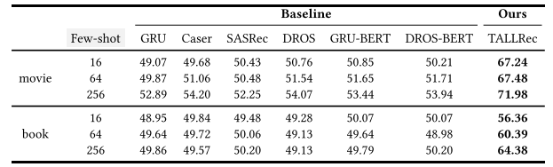

​	前人尝试：

​	①上下文学习，LLM作为排序器==>发现它始终提供单一的统一答案(表现并不比随机猜测好)或拒绝回答

​	②一些尝试仍然依赖于传统的用户/项目ID来表示用户/项目。这种方法未能利用LMs固有的语义理解能力，这可能会提高推荐系统的准确性和有效性。

## ⭐失败原因

1）LLM可能与推荐**任务不太一致**，因为用于LLM的**训练任务与推荐任务**之间存在巨大差距（领域知识不足）。此外，在LLM的训练阶段，面向推荐的语料库是非常有限的(**推荐数据不足**)

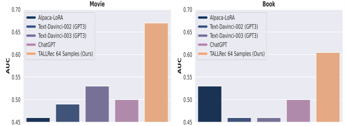

•**基于LLM**的方法执行类似于AUC值接近**0.5的随机猜测**。然而，使用我们的TALLRec训练的LRLM比它们有了显著的改进。这些结果验证了**推荐任务和语言任务之间存在相当大的差距**，并表明了推荐数据和推荐调整在激发LLM的推荐能力方面的重要性。

​	+**指令调优**是让LLM学习解决**不同任务**的核心，并且具有较强的泛化能力。

​		→我们以类似于**指令调优**过程的方式构建训练数据，并随后在指令调优阶段后训练LLM，以便于LLM获取推荐任务。

​	+考虑到LLM训练需要**大量的数据**

​		→我们选择采用**轻量级的微调方法**来有效地使LLM适应推荐任务。

2） LLM的效果受到**基础推荐模型的限制**，由于其能力有限，这些模型可能无法将目标项目包括在其候选列表中。

​	→因此，我们考虑建立一个**大型推荐语言模型**（LRLM），以弥合LLM和推荐任务之间的差距，并在上下文学习之外更好地激发LLM的推荐能力。

## ⭐贡献

- TALLRec框架

  - LoRA架构的LLaMA-7B模型，部署在Nvidia RTX 3090（24GB）GPU                                                       → **低GPU成本**

  - 有效性和稳健性：

    1）我们的TALLRec框架仅用几个例子（少于100个）就可以快速激发推荐能力；                                     → **少量调整样本**

    2）鲁棒的**跨域泛化**能力：例如，电影→ 书

# 一、TALLRec

## 微调

### 	指令微调

​			LLM通用训练过程。我们使用Alpaca([斯坦福羊驼：当前的 Alpaca 模型是从 7B LLaMA 模型对 Self-Instruct 论文中的技术生成的 52K 指令跟踪数据进行微调的，并进行了一些修改]([GitHub - tatsu-lab/stanford_alpaca：用于训练斯坦福大学羊驼模型并生成数据的代码和文档。](https://github.com/tatsu-lab/stanford_alpaca)))提供的自我指导数据来训练我们的模型。条件语言建模目标如下：

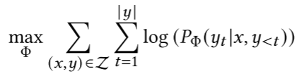

> self-instruct:
>
> 结论：
>
> ​	总的来说，self-instruct提供了一种从高质量的LLM模型中蒸馏知识的一种有效方式，即通过从高质量的预训练好的LLM上接口获取有监督的数据，来调优模型，将大模型的知识蒸馏出来，部署到目标模型上。
>
> 过程：
>
> ​	生成任务指令：首先，初始化一个**任务池**，该任务池中包含175个任务，每个任务都有一条人工编写的指令和实例。通过自举的方法生成指令。具体的方法是从任务池中抽样8条指令（6条人工编写的，2条之前步骤中模型编写的）作为学习样例，然后通过提示模板组合在一起，输入模型，让模型提出新的任务。模板如下：
>
> 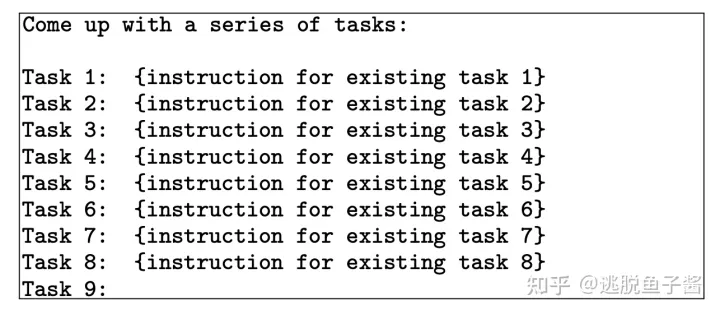
>
> ​	任务分类：因为论文定义了两种不同的方法来处理分类任务和非分类任务，所以需要确定生成的指令是否代表分类任务。具体的方法是将来自任务池中的12条分类指令和19条非分类指令作为学习样例，和模型在上一步提出的任务指令组合在一起输入模型让模型进行分类。提示模板如下表：
>
> 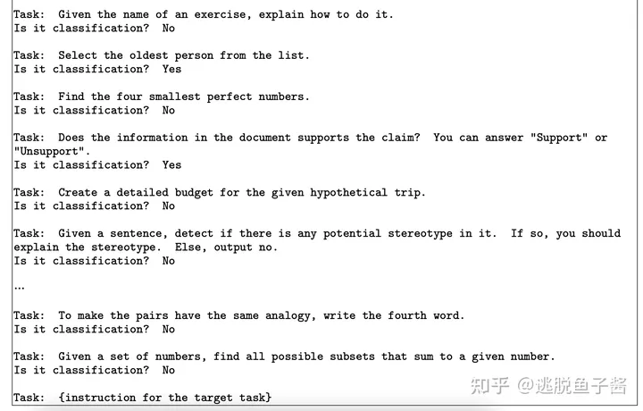
>
> ​	生成输入和输出样本：为了让模型理解任务，从**模型池**中取出其它任务的instruction-input-output作为学习样例，让模型对给定的任务生成输入和输出。一种自然的方法是**输入优先**方法，在这种方法中，LM首先根据指令提出输入字段，**然后**产生相应的**输出**。这种生成顺序类似于模型用来响应指令和输入的方式，提示模板如下：
>
> 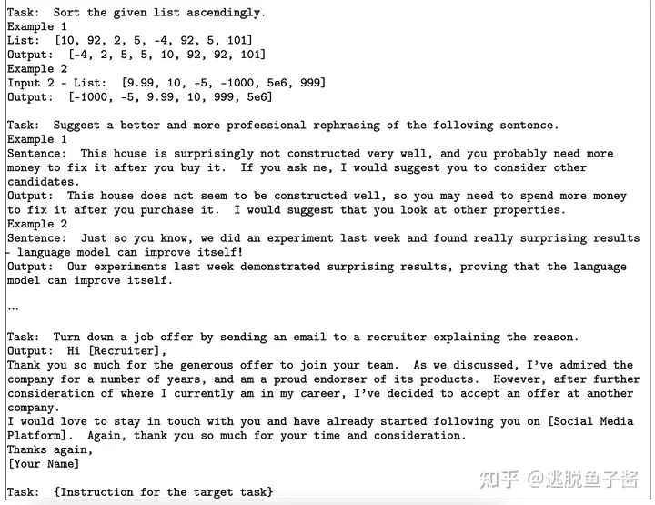
>
> ​				但是对于**分类**任务，输入优先可能倾向于生成偏向于一个标签的输入，例如对于语法错误检测，它通常会生成正确的语法。因此提出输出优先方法，在这种方法中，LM首**先**根据指令提出**输出**字段，**然后**产生相应的**输入**，提示模板如下：
>
> 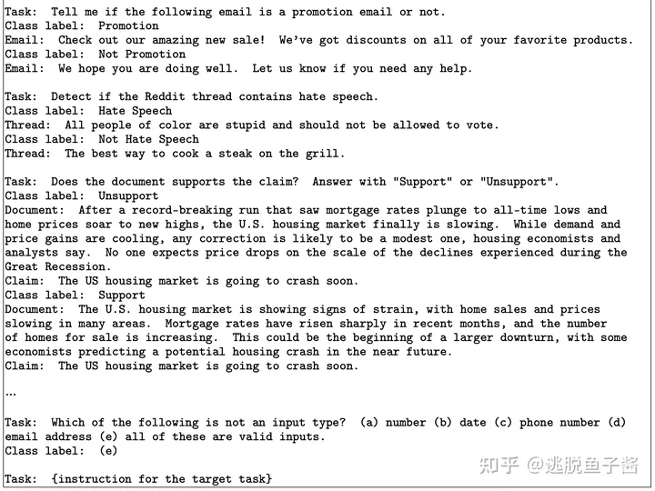
>
> ​	过滤样本：为了鼓励多样性，只有当一条新指令与任何现有指令的ROUGE-L相似度小于0.7时，才会添加到任务池中。还排除了包含一些特定关键词(例如，图像，图片，图形)的指令。当为每条指令生成新实例时，过滤掉完全相同或具有相同输入但不同输出的实例。并基于启发式方法(例如，指令太长或太短，实例输出是输入的重复)过滤掉无效的指令。ROUGE-L属于 文本生成评价指标，计算的时候使用了机器译文C和参考译文S的最长公共子序列，计算公式如下：
>
> 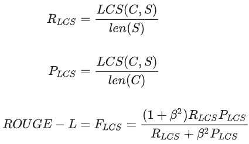即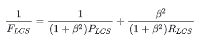
>
> ​	对原始模型微调：具体的做法是将指令和实例输入作为提示连接起来，并训练模型以标准的监督方式生成实例输出。为了提高模型的鲁棒性，使用多个模板将指令和实例输入编码在一起。

### 		推荐微调

​			针对推荐任务，模仿指令微调，推荐数据格式化为指令调优的格式

​		过程：

1. **编写Rec Instruction**，该指令指导模型根据用户已表达过的偏好和厌恶来确定用户是否对目标项目有好感，并以“是”或“否”的二元答案进行回答
2. **将Rec Input转换成自然语言格式**。详细地说，我们首先根据评分将历史交互项目分为两组：用户喜欢的项目和用户不喜欢的项目。然后，我们将这两组与要推荐的目标项目结合起来。我们最后用自然语言表达这些信息，以形成最终的“Rec Input”——“User Preference：𝑖𝑡𝑒𝑚-1.𝑖𝑡𝑒𝑚-4.𝑖𝑡𝑒𝑚-𝑛 . 用户取消引用：𝑖𝑡𝑒𝑚-2.𝑖𝑡𝑒𝑚-3.𝑖𝑡𝑒𝑚-𝑛−1.用户是否会喜欢目标电影/书籍：𝑖𝑡𝑒𝑚-𝑛+1”
3. 然后，我们将用户对新项目的反馈转换为“是/否”作为“Rec Output”。
4. 最终，我们将前面提到的“Rec Instruction”和“Rec Input”合并，创建一个用于Rec调优的“Instruction Input”。然后，我们将生成的“Rec Output”作为“Instruction Output”用于Rec调优，并以与指令调优阶段类似的方式在这些Rec调优样本上训练LLM，以构建LRLM。

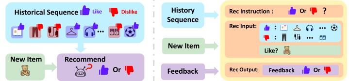

> 由用户u交互的历史项目被表示为如下的序列：[𝑖𝑡𝑒𝑚1.𝑖𝑡𝑒𝑚2.𝑖𝑡𝑒𝑚𝑛]. 序列中的每个项目都包含ID和文本信息（如，电影标题或书籍标题）
>
> 用户u反馈序列，表示为[𝑟𝑎𝑡𝑒1.𝑟𝑎𝑡𝑒2.𝑟𝑎𝑡𝑒𝑛], 𝑟𝑎𝑡𝑒𝑛 ∈ ｛1，0｝指示用户是否喜欢𝑖𝑡𝑒𝑚𝑛 
>
> 我们的任务是利用表示为M的LLM来构建表示为M_𝑟𝑒𝑐 , 其可以预测新项目（表示为𝑖𝑡𝑒𝑚__𝑛+1）
>
> 与新项目组合的历史序列表示为“Rec Input”
>
> LRLM的预测表示为“Rec Output”
>
> 推荐任务的“Task Instruction”表示为“Rec Instruction

## 轻量级微调

​	背景：在训练LLM时，直接对模型进行微调是计算密集型且耗时的。

​	中心前提：[LORA: 大型语言模型的低秩适应](http://www.baidu.com/link?url=sbvEbLJ5njzbX8Os2OsyjDnVSPA5uLaxgdBW037uJNoshNBaxQ_Z20NqvCLZDKzW)。LORA需要冻结预先训练的模型参数，并将可训练的秩分解矩阵引入Transformer架构的每一层，以促进轻量级微调。因此，通过优化秩分解矩阵，我们可以有效地合并补充信息，同时将原始参数保持在冻结状态。总的来说，最终学习目标可以计算为：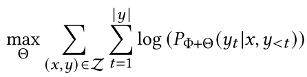

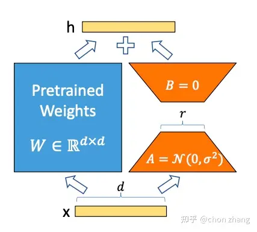

# 二、实验

## 骨干选择：选LLM

​	GPT系列处于数据安全角度，不用第三方API

​	PaLM、CHinchilla不提供对其模型参数或API的访问，这使得它们难以用于研究或其他应用

​	**LLaMA**属于公共LLM，符合实际现实场景，并更新其参数以进行推荐

## 数据集

​	电影：这是一个源自**MovieLens100K**基准数据集的改进数据集，该数据集包括一到五部电影的用户评分以及电影的全面文本描述，如“标题”和“导演”。具体而言，我们通过采样最近的10000次互动作为**预测目标**，并以8:1:1的比例将其分配到训练、验证和测试集来处理原始数据集。为了为用户的每个预测目标项目构建完整的数据样本，十个先前的用户交互被保留为**历史交互**。此外，我们使用阈值3将**评级**转换为二进制标签，其中超过3的评级被标记为“喜欢”（'1'），而低于3的评级则被标记为”不喜欢“（'0'）。

​	书籍：**BookCrossing**数据集包括1-10分的书籍用户评分，以及书籍的文本描述，如“书籍作者”和“书名”的信息。为了创建所使用的数据集，我们随机选择用户交互的项目作为用户的**预测目标**，并对用户交互的剩余10个项目进行采样，作为目标项目的**历史交互**。对原始数据集中的每个用户重复此采样过程。随后，我们以8:1:1的相同比例将结果数据划分为训练集、验证集和测试集。此外，我们通过应用5的阈值来对**评级**进行二值化。

## 评价指标

​	**推荐的传统评估指标**：AUC(性能)

## 三个角度

### 	性能

#### 基于LLM的方法。

​	基于LLM使用上下文学习直接生成推荐。为了确保公平的比较，我们使用与TALLRec相同的说明，将这些方法与我们的任务相一致。具体而言，我们在不同的LLM上执行上下文学习：

​	K=64

基于LLaMA模型：

​	1）Alpaca-LoRA，是一个使用LoRA和指令调整来复制Alpaca结果的模型

GPT系列模型：

​	2）Text-Davinvi-002、3）Text-Daviniv-003、4）ChatGPT，其中Alpaca-LoPoRA

#### 传统推荐方法

​	由于我们的方法利用历史交互来预测后续交互，这与顺序推荐类似，我们打算将其与以下顺序推荐方法进行比较：

-GRU4Rec。利用GRU对历史序列进行编码

-GRU-BERT。假设**项目文本描述**是可用的，并且我们的方法将利用这些文本描述来生成推荐。为了确保我们的方法与基线方法之间的公平比较。**组合嵌入**=**CLS嵌入**+GRU4Rec的**初始项目嵌入**连接起来

-Caser。这是一个基于CNN的顺序推荐器，它将最近的项目序列嵌入为“图像”，并使用水平和垂直卷积滤波器学习顺序模式。水平过滤器的数量固定为16，而其高度在{2,3,4}内搜索，垂直过滤器的数量设置为1。

-SASRec：基于注意力

-DROS：分布式鲁棒优化技术

-DROS-BERT：类似GRU-BERT的处理

•在**few-shot**设置中，我们的方法**显著优于**传统和最近基于LLM的方法。这验证了通过我们的TALLReg框架将LLM调整为推荐人的优越性，该框架成功地利用了LLM丰富的知识和组合泛化能力进行推荐。

•**GRU-BERT和DROS-BERT**是用预训练语言模型（BERT）增强的传统推荐方法，它们与最初的方法相比没有任何改进，并且性能也不比随机猜测好。然而，我们的TALLRec方法显示出显著优越和有效的性能。**这些发现表明，将预先训练的语言模型与推荐任务直接结合起来，更适合释放其推荐潜力，避免受到传统推荐者的限制**。

### 	消融实验

#### ①组成部分

​		三种变体：

1. “IT”表示仅进行初始指令调整的版本
2. “RT”表示仅执行推荐调整，
3. “IT+RT”表示完整版本。

•将“RT”、“IT +RT”与“IT”进行比较，我们发现具有**推荐微调**的变体RT带来了明显的性能改进。这一发现验证了推荐调整在激发LLM推荐能力方面的有效性和必要性。

•当训练样本的数量极其有限（≤128）时，“IT+RT”通常优于“RT”。这一观察结果证实，**指令调整**可以增强LLM的泛化能力，以快速适应新任务，并将其与推荐调整相结合，可以进一步提高我们在**训练数据最少**的场景中的推荐调整效果。

#### ②训练样本的数量

​	𝐾-shot设置的数量，即所使用的**训练样本的数量**，以调查训练样本数量对这些变体和基线的影响。

> 看斜率

•我们的方法显示出在少于50个训练样本的情况下快速激发推荐能力的能力，优于传统的推荐方法。这一发现验证了在few-shot训练环境中，将LLM的知识丰富和组合泛化能力与推荐相结合的优越性，展示了我们的建议在数据有限的推荐场景中的巨大潜力。

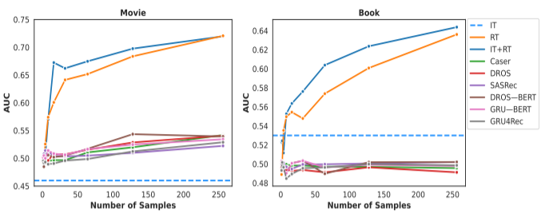

### 	泛化性：**跨领评估**

​	具体而言，我们使用TALLRec框架和不同的数据集训练了三个LRLMs，包括1）“IT+RT（书籍）”，仅在书籍数据集上训练；2）“IT+RT（电影）”，只在电影数据集上培训；以及3）“IT+RT[mutli]”，在书籍和电影数据集都训练。

​	我们在多个少镜头训练设置下训练这些模型（K=16,64258），并在Book和Movie域的测试集上对它们进行评估。

**结论**：

•我们的TALLRec框架展示了显著的跨领域泛化能力。例如，在仅对电影数据进行训练后，所获得的模型在书籍数据上表现出很强的性能，与仅对书籍数据进行训练的模型相当。**这给人留下了深刻的印象**，表明该模型学习任务本身，而不是像传统的推荐器那样仅仅拟合数据。

•我们提出的TALLRec可以同时利用来自两个不同域的数据来提高跨域的推荐性能。例如，我们可以看到，在电影数据集上，在大多数情况下，混合使用书籍和电影数据比仅对电影数据进行训练表现更好。这表明TALLRec可以无缝地合并来自不同域的数据，以提高其性能。

## 基线

# 三、未来展望

探索更有效的方法来激活大型模型的推荐能力，并开发一种可以同时处理**多个推荐任务**的LLM。
